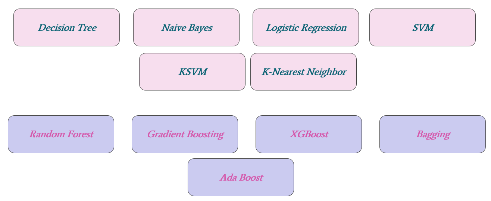

# BoxOffice - Prediction of the success of movies
The project objective is to predict profitability of any movie before it is released, with a Return On Investment of 95%. The Target Variable ROI is a computed value of binary class, various Classifiers are being tested  

## Features Importance for Prediction

## Classification Algorithms Tested

  
## Models Accuracy and ROC curve

## XGBoost results - Best Classifiers
